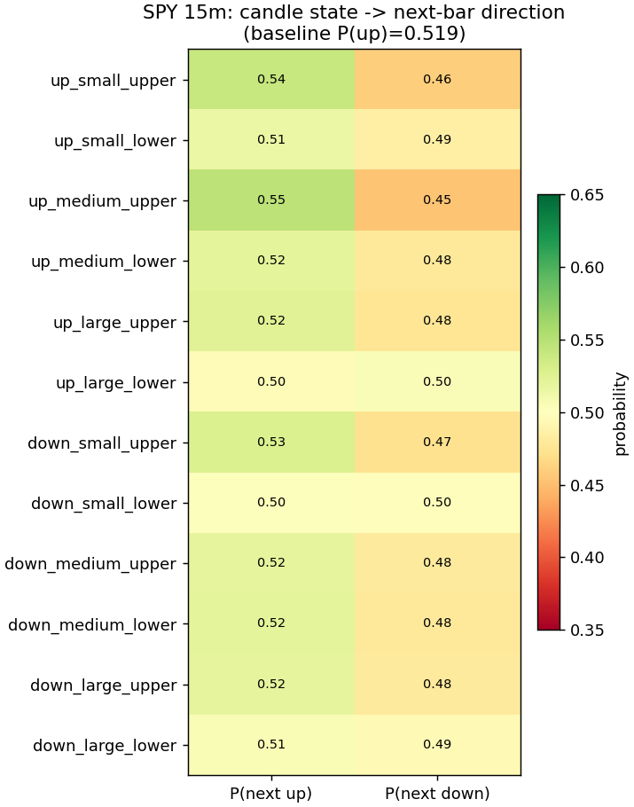
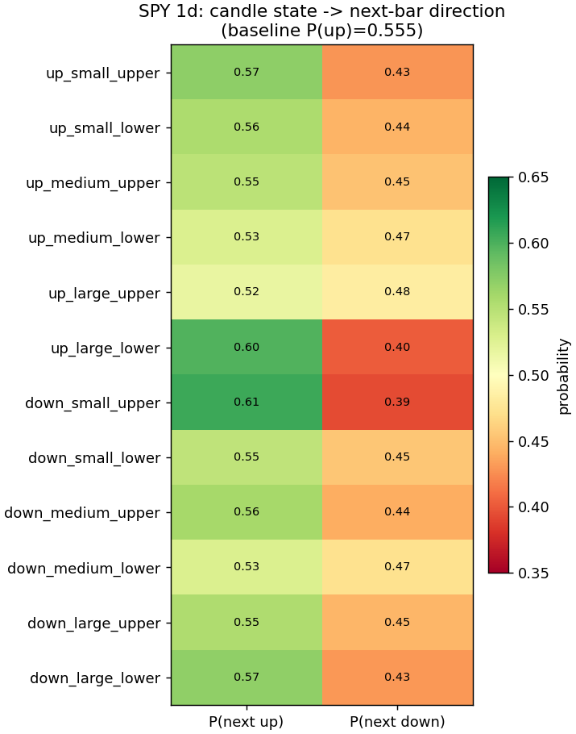
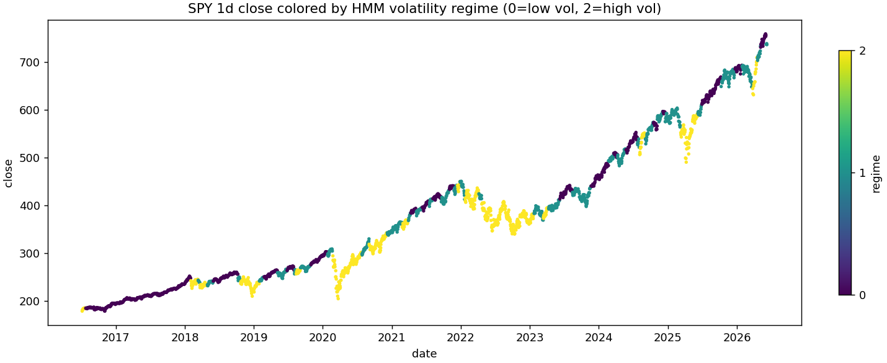
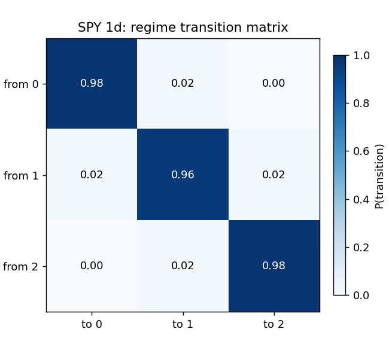
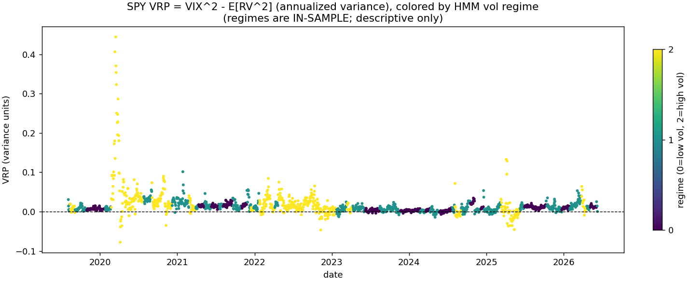
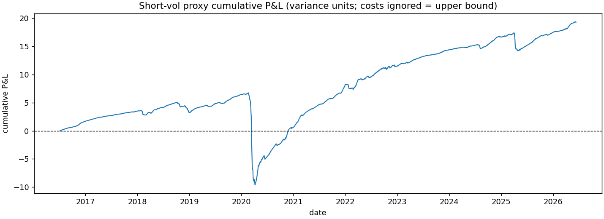
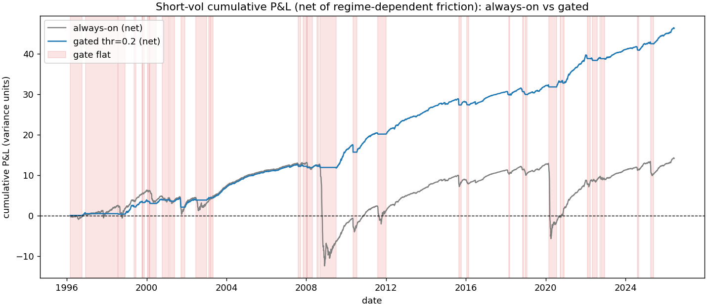

# Testing Candlestick Folklore and the Variance Risk Premium: a 30-Year Audit

**TL;DR:** I ran a four-script audit on SPY asking whether candlestick patterns predict the next bar, whether a volatility-regime filter can dodge short-vol tail risk, and whether any of it survives honest measurement. Candlestick direction signals fail after costs; a three-state HMM on volatility is real and persistent; the variance risk premium exists at roughly +3.8 annualized vol points once I fixed a Garman-Klass estimator bug that had inflated Sharpe from 6.15 to a still-positive 1.11. Causal regime gating on a stylized short-vol proxy holds up on a 2016–2026 holdout (friction-adjusted Sharpe 2.76), but defined-risk options translation is blocked by an ~80% synthetic pricer bias and a failed IV sanity gate. Everything below is simulated research output, not a live trading record.

---

Every retail trader eventually asks the same question: do candlestick patterns predict where price goes next? I decided to measure instead of believe. I built a small pipeline on SPY that discretizes each bar into one of twelve candle states, tests whether the next bar's direction depends on that state, and then asks what survives once you account for sample size, transaction costs, and the difference between in-sample labels and causal decoding.

The punchline arrived early. On fifteen-minute bars the patterns look statistically significant. They are also economically dead: a 0.56 basis-point gross edge turns into −1.44 bp after a conservative 2 bp round-trip cost proxy. Daily and hourly timeframes do not even clear the statistical bar. Underneath the folklore, though, a different structure kept showing up. A three-state hidden Markov model fit on returns and realized volatility separates calm, intermediate, and crisis-like regimes with a 3.47× spread in annualized vol on daily data. That volatility state, not candle-implied direction, is where the rest of this audit goes.

The second punchline is epistemic. When I first estimated the variance risk premium with a Garman-Klass realized-variance proxy, the short-vol carry looked extraordinary: friction-free Sharpe 6.15, mean premium +7.65 vol points. Those numbers smelled wrong against published SPY variance-risk-premium estimates in the +2 to +4 vol-point range. Switching to Yang-Zhang, which counts overnight gaps, cut the apparent Sharpe by roughly eighty percent (6.15 → 1.11) and doubled the measured COVID drawdown. Only after that accounting did I trust the premium enough to gate it causally across thirty years of history.

---

## The candle experiment

**Methods (summary).**

- **States:** twelve buckets from direction (up/down) × body-size tercile (small/medium/large) × dominant wick (upper/lower).
- **Test:** Pearson chi-square of candle state vs next-bar direction; Wilson confidence intervals on per-state P(up).
- **Economic filter:** gross edge proxy = strongest deviation in percentage points × mean |next-bar return|; net edge subtracts 2 bp round-trip cost.
- **Regimes:** in-sample three-state Gaussian HMM on [log return, log realized vol]; descriptive only on this script.

I ran the pipeline on daily (yfinance, ~10 years), hourly, and fifteen-minute bars (Alpaca IEX with Massive fallback). The cross-timeframe comparison is the honest summary.

| Timeframe | n_obs | χ² p-value | Strongest dev (pp) | Gross edge (bp) | Net @ 2 bp (bp) | HMM vol spread |
|-----------|------:|-----------:|-------------------:|----------------:|----------------:|---------------:|
| 1d        | 2,494 | 0.7915     | +5.10              | 7.43            | +5.43           | 3.47×          |
| 1h        | 7,219 | 0.1856     | −3.81              | 1.51            | −0.49           | 2.26×          |
| 15m       | 36,187| 0.0033     | +2.70              | 0.56            | −1.44           | 2.08×          |

Daily bars show the cleanest contrast between statistics and economics. The unconditional chi-square p-value is 0.79. No pattern survives multiple-comparison scrutiny within HMM regimes (best regime-conditioned p = 0.09). Yet the gross edge proxy on the strongest state is 7.43 bp because daily moves are large (mean |next-bar return| ≈ 73 bp). That is a different failure mode than the fifteen-minute case.

The fifteen-minute trap is the one that fools a researcher who stops at p-values. With n = 36,187, the unconditional test rejects at p = 0.0033. The strongest state (`up_medium_upper`) shows P(up) = 54.6% vs a 52.0% baseline, a +2.7 percentage-point deviation. Multiplying by the tiny mean next-bar move (10.4 bp) yields 0.56 bp gross. After 2 bp costs the edge is −1.44 bp. I also split the session into open, midday, and close buckets; only the pooled sample is significant, which is consistent with a thin, time-heterogeneous effect rather than a robust tradable signal.

Large n makes p-values cheap. A fixed five-percent edge in probability on a fifty-fifty baseline needs only a few hundred observations to reject the null. At thirty-six thousand bars, a two-point deviation in P(up) is trivially "significant" while remaining economically irrelevant after realistic friction. The script's own verdict on 15m data: "statistically real but economically negligible (classic in-sample mirage)."


  
  *Fifteen-minute candle states vs next-bar P(up); color shows deviation from baseline, not tradable edge.*

  


  
  *Daily candle states vs next-bar P(up); unconditional test is not significant (p = 0.79).*

---

## The regime layer

Once direction failed, I fit the HMM on volatility because crashes are a variance event, not a candle-shape event. The model uses three Gaussian states on log return and log realized variance. On daily SPY it finds cleanly separated regimes:

| Regime | n_days | Ann. vol | P(up) | Avg duration (days) |
|-------:|-------:|---------:|------:|--------------------:|
| 0 (low) | 998 | 8.3% | 58.0% | 55.4 |
| 1 (mid) | 785 | 13.7% | 54.7% | 25.3 |
| 2 (high)| 712 | 28.8% | 52.8% | 47.5 |

High-vol annualized volatility is 3.47× low-vol. Transition probabilities sit near 0.98 on the diagonal: regimes persist. Conditioning candle chi-square tests on these regimes does not rescue directional prediction; the best regime-level p-value on daily data is 0.09. Volatility structure is far stronger than directional structure.

On fifteen-minute intraday data the vol spread is smaller (2.08×) but the same story holds: regimes separate variance, not next-bar direction.


*Daily SPY colored by decoded volatility regime; crises cluster in the high-vol state.*



  *Empirical HMM transition probabilities; diagonal persistence dominates.*

---

## The variance risk premium

**Methods (summary).**

- **Forecast:** HAR-RV in log space, expanding window, monthly refit, three-year burn-in.
- **Leakage guard:** on refit day T, training rows must have a fully realized 22-day target window (index i satisfies i + 22 ≤ T).
- **VRP:** VIX² (implied variance) minus HAR forecast of next-22-day realized variance, evaluated out-of-sample only.
- **Payoff proxy:** daily P&L ≈ prior-day VRP × (realized variance − implied variance); costless upper bound, not a tradable swap.

On 2,495 daily SPY/^VIX observations (2016–2026), the Yang-Zhang specification gives:

| Metric | Value |
|--------|------:|
| OOS days | 1,699 |
| HAR OOS R² vs naive 22d trailing RV | +0.367 |
| Mean VRP (vol points) | +3.81 |
| Days VRP > 0 | 88.9% |
| Newey-West t-stat (22 lags) | +6.03 |
| Mean implied vol | 21.93 pts |
| Mean forecast vol | 18.12 pts |

The premium is positive, statistically robust, and regime-dependent. Mean VRP in variance units by HMM regime ranges from 0.0092 (low vol) to 0.0241 (high vol). In the 22 days after entering the high-vol regime, mean VRP is 0.0284 vs 0.0131 on all other days. The short-vol proxy earns positive carry overall (costless Sharpe 1.11) but with a brutal left tail: max drawdown 16.35 variance units, COVID March 2020 P&L −14.44, 2022 full year +3.31.


*Implied minus forecast variance (vol-point scale) through the sample.*


*Stylized short-vol proxy; steady carry with episodic crash losses.*

---

## The estimator bug

This is the section I wish I had written first.

My initial realized-variance estimator was Garman-Klass on intraday open-high-low-close ranges. GK is a within-bar formula: it uses each session's open, high, low, and close and never sees the close-to-open gap between sessions. For SPY, overnight moves carry roughly a quarter to a third of total variance under normal conditions, and far more than that during crashes, which gap. VIX, meanwhile, prices around-the-clock variance because options do not stop accruing risk at the cash close. I was comparing an all-hours implied number against a realized measure that structurally dropped overnight risk. Of course the premium looked huge, and of course the tail looked tame.

GK therefore understated realized variance, overstated the variance risk premium, and hid tail risk in the short-vol proxy. SPY's crash variance lives in those gaps.

The smell test was literature, not code review. Published SPY VRP estimates cluster around +2 to +4 annualized vol points. My GK pipeline reported +7.65 vol points and a costless Sharpe of 6.15. That gap was large enough to distrust the magnitudes even while the sign (premium exists) still looked right.

I reran everything with Yang-Zhang, which blends overnight and intraday components. The sign of every conclusion stayed the same. The magnitudes changed sharply.

| Metric | GK (old) | Yang-Zhang (new) |
|--------|----------:|-----------------:|
| HAR OOS R² vs naive | +0.376 | +0.367 |
| Mean VRP (vol points) | +7.65 | +3.81 |
| VRP % days positive | 99.9% | 88.9% |
| Proxy Sharpe (costless) | 6.15 | 1.11 |
| Proxy Sharpe (8% friction) | 4.90 | 0.65 |
| 2020-03 P&L (costless) | −5.00 | −14.44 |

Sharpe fell by about eighty-two percent. The COVID-month loss roughly tripled in severity once gaps were counted. The HAR forecast quality barely moved (R² +0.376 → +0.367), which told me the bug was in the payoff denominator, not the forecaster. I treat every number before this fix as a cautionary exhibit, not a result.

---

## Causal regime gating

Gating the short-vol proxy on "do not hold in high volatility" is obvious once you see the tail. The subtle part is causality. In-sample Viterbi decoding peeks at the full sample path. That is look-ahead. I replaced it with walk-forward HMM refits every 63 trading days (expanding window, three-year burn-in) and filtered state probabilities from the forward algorithm only.

I caught a second leak after that. Using same-day filtered P(high vol) to flatten the position on day t uses information that would not be actionable until after the close. The fix is a one-day gate lag: the position held on day t is set from P(high vol) at t−1.

To stress-test tail risk I extended history to 8,377 joint SPY/^VIX days (1993 load, ~7,617 causal strategy days after burn-in). One COVID is not a sample. Thirty years give 39 distinct high-vol filter excursions.

**Causal filter diagnostics**

| Metric | Value |
|--------|------:|
| Causal vs Viterbi agreement | 85.8% |
| Avg lag entering high vol (Viterbi → causal) | 2.1 days |
| Viterbi-gated Sharpe (friction-adj) | 2.69 |
| Causal-gated Sharpe (friction-adj, best thr) | 2.20 |
| Downgrade from causality | −0.49 Sharpe |

**Threshold sweep (full sample, base friction 7.8% of credit, 3× in high vol)**

| Strategy | Sharpe (costless) | Sharpe (friction-adj) | Max DD | % in market | 2020-03 P&L | 2022 P&L |
|----------|------------------:|----------------------:|-------:|------------:|------------:|---------:|
| always_on | 1.49 | 0.25 | 25.54 | 100.0 | −15.01 | +0.29 |
| thr_0.2 | 3.40 | 2.20 | 2.30 | 72.0 | 0.00 | −0.85 |
| thr_0.4 | 3.40 | 2.14 | 2.30 | 72.6 | 0.00 | −1.41 |
| thr_0.6 | 3.33 | 2.02 | 2.28 | 73.2 | 0.00 | −1.64 |
| thr_0.8 | 3.30 | 2.00 | 2.28 | 73.7 | 0.00 | −1.32 |

Gate trips (position flips) cost 6.11 variance units in whipsaw friction across 77 flips. That is real drag, but small next to the 25.54 always-on drawdown the gate avoids.

**Holdout (threshold chosen on 1996–2015 only, tested 2016–2026)**

| Split | Sharpe (friction-adj) | Max DD | % in market | Cum P&L | Days |
|-------|----------------------:|-------:|------------:|--------:|-----:|
| In-sample (<2016), thr=0.4 | 1.91 | 2.30 | — | — | 4,993 |
| Out-of-sample (≥2016) | 2.76 | 1.59 | 84.8 | +17.23 | 2,624 |

The holdout Sharpe exceeding the in-sample selection Sharpe is the strongest single piece of evidence in this repo. I did not tune the threshold on the OOS decade. That OOS decade contains COVID, so the result where OOS beats in-sample partly reflects tail concentration in the test window and should be read alongside that caveat, not as proof the gate generalizes to every future decade.

**Per-crisis table (gated thr = 0.4, selected pre-2016)**

| Crisis | Always-on P&L | Gated P&L | % flat | Warn lag | OOS? |
|--------|--------------:|----------:|-------:|---------:|:----:|
| GFC 2008-09 | −21.00 | −0.52 | 96% | +6d | sel |
| Flash crash 2010 | −2.76 | −1.81 | 80% | +4d | sel |
| US downgrade 2011 | −2.79 | −0.25 | 83% | +4d | sel |
| Aug 2015 | −2.17 | −1.48 | 24% | +16d | sel |
| Volmageddon Feb 2018 | −0.76 | −0.76 | 0% | never | OOS |
| Q4 2018 | −1.84 | −1.56 | 32% | +28d | OOS |
| COVID (Feb through Apr 2020) | −14.92 | −0.76 | 73% | +16d | OOS |
| 2022 full year | +0.29 | −1.41 | 58% | +20d | OOS |

*COVID P&L note: the threshold-sweep table reports −15.01 for calendar March 2020 only; the per-crisis row sums Feb through Apr 2020 (−14.92 always-on). Same episode, different windows.*

Three named failure modes explain where gating still bleeds.

**Jump-speed events.** Volmageddon never triggered a flat day (0% flat, warn lag "never"). The filter needs persistence; a one-day vol spike can damage the position before probabilities cross the threshold.

**Slow bleeds.** 2022 is the clearest example: always-on earned +0.29 variance units while gated lost −1.41 because the gate stayed partially invested (58% flat) and whipsawed in a grinding bear.

**Tail concentration.** COVID alone is roughly fifty-nine percent of the always-on max drawdown. The gated strategy dodged most of that (−0.76 vs −14.92), which means a large fraction of the gated edge comes from a handful of episodes. Deflated Sharpe after four threshold trials still reports P(true SR > 0) = 1.00, but that does not inflate away dependence on fat-tail events.

Refit cadence sensitivity (21/63/126 days) moves friction-adjusted Sharpe only from 2.16 to 2.20. Post-2000-only Sharpe matches the full sample at 2.20, so the conclusion does not hinge on pre-2003 back-computed ^VIX.


*Full-history stylized proxy; shaded regions show flat gates.*

---

## Structure translation

Everything above prices a stylized variance swap. Retail cannot trade that. The final experiment asks whether the gated short-vol idea survives translation into defined-risk option structures: a 30-delta / 15-delta put credit spread (and, in parallel, an iron condor), opened monthly at roughly 30 calendar days to expiry, held to settlement, sized at 2% of equity at risk per trade, with the same causal gate at threshold 0.4 (holdout-selected on 1996–2015).

**Synthetic pricer design.** Historical NBBO quotes are not entitled on my data plan; I have Massive option aggregates for roughly the last two years only. The bridge is a parametric pricer: ATM implied vol anchored at `(VIX − 1.17) / 100` (a 6a calibration against real strips), additive skew `IV = ATM + slope × (0.5 − |delta|)` with baseline slope 0.10, Black-Scholes legs, FRED DTB3 for the risk-free rate, and q = 1.5%. Strikes are solved for target deltas (30Δ short put, 15Δ long put) under that skew surface.

**The 80.6% bias discovery.** Validation against 25 monthly Structure A entries (one excluded for stale volume) immediately showed synthetic credits far above real bar mids: mean `(syn − real) / real = +80.6%` (median +67.3%), with synthetic credit mean 3.68 vs real 2.24 per share. A spread credit is a difference of two option prices, so a level error on each leg amplifies in the net. That magnitude demanded per-leg diagnosis, not a single flat haircut on the spread.

**Per-leg decomposition (Part 3B).** Both legs were wrong by similar multiplicative factors, pointing at ATM level bias rather than skew slope alone.

| Leg | Price bias (syn−real)/real | IV bias (vol pts) |
|-----|---------------------------:|------------------:|
| Short 30Δ put | mean +57.9%, median +43.1% | mean +3.60, median +3.65 |
| Long 15Δ put | mean +35.9%, median +29.4% | mean +1.62, median +1.72 |

The script's read: short leg ~1.43×, long leg ~1.29×, so ATM level bias dominates (+3.7 / +1.7 vol points on the legs). Aggregate credit bias on clean entries: mean +82.7%, median +70.5%. A mechanics audit passed DTE, units, and rate consistency; every entry failed strike equality because listed strikes never matched synthetic targets exactly.

**Recalibration, anchored rebuild, and the sanity gate.** A first recalibration pass fit level and slope freely to inverted leg IVs from the real bars. The fit could reduce aggregate bias numerically while implying something the index has not exhibited in decades: 30-delta puts trading below ATM volatility, inverted put skew. So the rebuild anchored ATM at `(VIX − 1.17) / 100` with intercept forced to zero, fit a multiplicative skew slope via origin-only OLS, and added an explicit sanity gate: for each clean entry, compute real 30-delta put IV minus anchored ATM IV; if the median across entries is negative, stop, fit nothing, and fall back to a literature-prior pricer with everything labeled `pricer_uncertain`.

The gate fired. On 24 clean entries, 20 showed negative put-minus-ATM spreads; median = −1.65 vol points. That pattern is not a plausible SPY skew regime. It is the fingerprint of non-synchronous marks: a daily option bar can reflect an afternoon trade inverted against the 4:00 p.m. underlying close, and on a day SPY moves half a percent, that alone can shift implied vols by vol-point scale. The data tier structurally cannot yield synchronous per-leg IVs for recalibration. The pipeline detected that and refused to launder contaminated inputs into "calibrated" parameters. I consider that refusal the system's best moment in this phase.

**Final results (`pricer_uncertain`, literature skew prior 0.15).**

| Structure | Variant | Sharpe | Max DD |
|-----------|---------|-------:|-------:|
| Put credit spread | always_on | 0.47 | 8.5% |
| Put credit spread | gated_skip | 0.63 | 5.3% |
| Iron condor | always_on | 0.46 | 9.6% |
| Iron condor | gated_skip | 0.65 | 8.4% |

For comparison, the variance-proxy gate on the same history posts friction-adjusted Sharpe 2.23 vs 0.63 on gated PCS. Hold-to-expiry (`gated_skip`) beat intra-month exit when the filter tripped: Sharpe delta −0.40 for `gated_exit`, because exiting into a vol spike pays stressed friction at the worst moment; the defined-risk floor defends more cheaply than the exit.

The project's most useful sentence from this phase, earned across baseline skew, flat-haircut attempts, the broken free recalibration, and the literature prior: **the relative conclusions proved robust to pricer uncertainty, absolute conclusions did not.** In every variant, gating improved risk-adjusted return and cut drawdown, with crisis saves concentrated in slow regime-speed events like the GFC and COVID. What flipped across variants was whether absolute carry clears zero after real friction, because that depends on two quantities this data tier forces me to assume: the true credit received at entry and the true cost of crossing the bid-ask spread.

---

## What this does not show

I want the fence posts visible.

The short-vol payoff is a stylized variance proxy, not a tradable variance swap or listed option position. You cannot deposit Sharpe 2.20 in a brokerage account from this series alone.

Friction assumptions come from a `FrictionConfig` snapshot (7.8% round-trip of credit, tripled in high vol). Historical NBBO quotes are not entitled on my data plan; Part 6 of the VRP script falls back to trade-based mids. Real options friction may differ.

The HMM uses three states because that is what I specified. The gate thresholds {0.2, 0.4, 0.6, 0.8} are a researcher sweep, not an exogenous market law. Four trials are few, but they are still trials.

Skew and kurtosis on short-vol payoffs are extreme (sample skew −23.3, kurtosis 888.5 on gated returns). Sharpe is an incomplete summary of that distribution.

Finally, one strategy idea survived many tests in this repo (candles, regimes, estimators, gates, structures). That survivorship carries selection risk no deflated Sharpe fully cures.

---

## Lessons

1. **Leakage hides in estimators, not just train/test splits.** I had a walk-forward HAR forecaster and still nearly published a fake Sharpe 6.15 because the realized-variance denominator ignored overnight gaps. Fixing the estimator mattered more than another cross-validation fold.

2. **Literature values are a free smell test.** When my VRP hit +7.65 vol points against a +2 to +4 literature band, that was reason to pause before tweeting results. The sign was right; the magnitude was wrong.

3. **Statistical and economic significance diverge at large n.** Thirty-six thousand fifteen-minute bars produce p = 0.003 for a sub–1 bp gross edge. The chi-square and the wallet disagree.

4. **One tail event is not a sample.** A ten-year SPY window can look brilliant until COVID arrives once. Thirty years and 39 high-vol excursions are closer to the relevant sample size for tail-gated strategies.

5. **Causality costs Sharpe, and the honest number is the lower one.** Viterbi gating at 2.69 friction-adjusted Sharpe vs 2.20 causal is the tax of not peeking. I report 2.20.

6. **Negative results are deliverables.** Candlesticks failing, 2022 gated underperformance, Volmageddon non-detection, and the structure-translation pricer failure are findings. They bound what is left to believe.

---

## Next steps

The backtest has reached the ceiling of what this data tier can decide. The two unknowns that determine absolute viability, real entry credits and real crossing costs, are measurable only forward. The honest follow-on is a forward logging protocol: one gated put credit spread per month on quoted OPRA bid-ask, compared to the synthetic pricer on the same strikes and date. Twelve months of synchronous observations would decide whether the relative edge documented here clears zero in absolute terms. Either answer closes the question honestly.

---

## Reproducibility appendix

**Environment**

- Python 3.11+ (`requirements.txt` pins pandas 2.3.3, scipy 1.17.1, statsmodels 0.14.6, hmmlearn 0.3.3, matplotlib 3.10.9)

**Data sources**

| Data | Source | API key? |
|------|--------|----------|
| SPY daily (VRP window) | yfinance cache `data/SPY_VIX_1d.parquet` | No |
| SPY daily (full history) | yfinance cache `data/SPY_VIX_1d_full.parquet` | No |
| SPY 1h / 15m | Alpaca IEX cache, Massive fallback | `ALPACA_*`, `MASSIVE_API_KEY` for refresh |
| FRED DTB3 | cache `data/fred_DTB3.parquet` | `FRED_API_KEY` for refresh |
| Option bars (validation) | Massive cache `data/massive/*.parquet` | `MASSIVE_API_KEY` |

**Run commands** (from repo root, `source .venv/bin/activate` first):

```bash
python candle_markov_experiment.py --timeframes 1d 1h 15m   # ~20 s cached
python vrp_experiment.py --no-part6                        # ~5 s cached
python regime_strategy_experiment.py                         # ~5 s cached; ~20+ min cold HMM
python structure_translation_experiment.py                 # ~7 s cached
```

Add `--no-part3` to the structure script to skip Massive validation. Omit `--no-part6` on the VRP script only if `MASSIVE_API_KEY` is set. First runs download data; HMM caches land in `data/causal_filter_*.parquet`. Figures write to `output/`.

All P&L, Sharpe, and drawdown figures in this document are simulated research output from these scripts. They are not live account performance.

---

*This analysis is research, not investment advice.*
